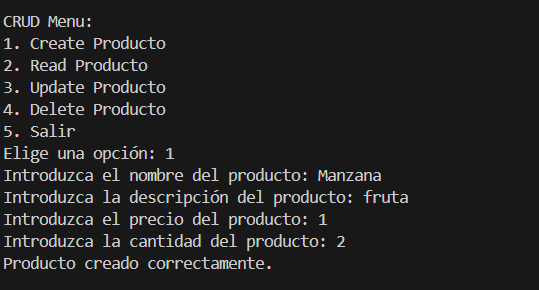
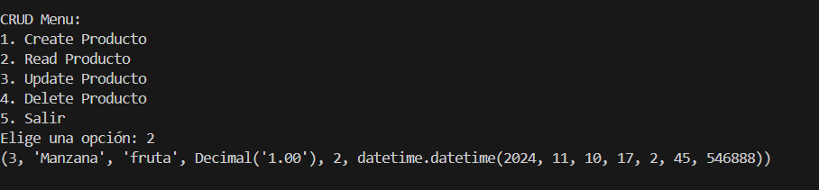
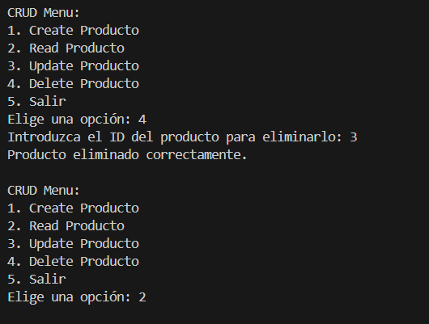

# Actividad 7 - Python + PostgresSQL

## Operación Create

Para crear esta operacion nos pedirá a través de un menú que introduzcamos 
el nombre de cualquier producto que deseemos en este caso puse que el 
producto sea una Manzana. Una vez que pongamos el nombre nos pedirá la 
descripción y le puse fruta. Luego nos pedirá el precio del producto que en 
este caso puse que sea de 1€. Finalmente nos pedirá la cantidad que deseemos 
y le puse 2, una vez llenemos los campos nos saldrá un mensaje de Producto 
creado correctamente

	

## Operación Read

Para poder ver el producto que hemos creado pondremos la opción numero 2 del
menú. Esta operación lo que hace es leer el producto que hayamos introducido
y muestra la id, el nombre, la descripción, el precio y la cantidad. En este
ejemplo vemos que la id es el numero 3, el nombre es Manzana, la descripción
es fruta, el precio es de 1 y la cantidad es 2.

        

## Operación Update

Para poder actualizar el producto que hemos creado pondremos la opción numero
3 del menú. Esta operación lo que hace es actualizar un producto existente en
la base de datos. Para ello nos pide la id del producto a actualizar, en este
caso he actualizado el producto con la id numero 3. Nos pide que pongamos el 
nombre del nuevo producto, en mi caso puse pelota, en descripción puse juguete
el precio de 10€ y de cantidad 1. Una vez llenado los campos nos saldrá un 
mensaje de Producto actualizado correctamente. Para poder ver si el producto
a sido actualizado pondremos la opción 2 del menú y vemos que se a actualizado

        

## Operación Delete

Para poder eliminar el producto que hemos creado o actualizado pondremos la 
opción numero 4 del menú. Esta operación lo que hace es eliminar el producto
a traves de la id. Nos pedira la id del producto que deseemos eliminar, en
este caso la id numero 3 si se a eliminado nos saldrá un mensaje de Producto
eliminado correctamente. Para verificar que el producto a sido eliminado
escogemos la opcion 2 del menú y vemos que ya no sale el producto que habiamos
creado

        

